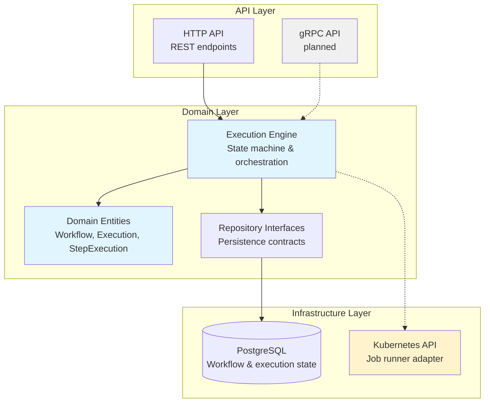

# Aeneas

**A Kubernetes-native workflow orchestration engine for multi-step job execution**

---

## Problem Statement

Modern CI/CD pipelines and data processing workflows need to orchestrate complex sequences of containerized tasks. Existing solutions like Argo Workflows and Tekton solve this well, but they introduce significant operational overhead for teams that need simple, reliable task orchestration without the complexity of full GitOps platforms.

**Aeneas** provides a lightweight, Kubernetes-native alternative: define workflows as sequences of container steps, execute them as Kubernetes Jobs, and track their lifecycle through a clean REST API.

---

## Why Build This?

This project demonstrates:

1. **Systems thinking** — Workflow orchestration is a well-understood domain with clear boundaries, making it ideal for showcasing clean architecture patterns
2. **Production-grade Go** — Modern Go service design with domain-driven structure, interface-based persistence, and comprehensive test coverage
3. **Kubernetes expertise** — Native integration with the Kubernetes API for job management and lifecycle tracking
4. **Engineering judgment** — Intentional scope management (MVP-focused) and honest documentation of tradeoffs

Rather than adding features to existing tools, Aeneas explores how to build a focused, maintainable orchestrator from first principles.

---

## Is Aeneas Right for You?

**TL;DR:** Aeneas is for small-to-medium teams orchestrating simple, Kubernetes-native workflows. If you need durable execution, multi-year workflows, or enterprise-scale orchestration, use Temporal, Argo, or Conductor instead.

👉 **Read the full comparison**: [Aeneas vs. Temporal vs. Argo vs. Conductor](docs/COMPARISON.md)

This document provides an honest assessment of when to use Aeneas (and when not to), including a feature matrix, architectural philosophy differences, and a decision framework to help you choose the right orchestrator for your use case.

---

## Architecture

Aeneas follows **hexagonal (ports & adapters) architecture** with a clean domain core:



**Key Components:**

- **Domain Layer**: Core business logic with enforced state transitions (`pending → running → succeeded/failed`)
- **Repositories**: Interface-based persistence adapters (PostgreSQL implementation complete)
- **Execution Engine**: *(planned)* Orchestrates step execution and state updates
- **Job Runner**: *(planned)* Kubernetes adapter to spawn and monitor Jobs

---

## Current Status

### ✅ Completed (Step 2: Domain Model and Persistence)

- **Domain entities** with full state machines for workflows, executions, and step executions
- **Repository interfaces** defining persistence contracts (`WorkflowRepository`, `ExecutionRepository`, `StepExecutionRepository`)
- **PostgreSQL implementation** with comprehensive test coverage (~1,500 lines of tested persistence logic)
- **State transition validation** ensuring workflows can only move through valid lifecycle states

### 🚧 In Progress

- **HTTP API** for workflow registration and execution triggers (Step 3)
- **Kubernetes Job runner adapter** (Step 4)
- **Execution engine** for step orchestration (Step 5)

### 📋 Planned

- gRPC API with protobuf-based service definitions
- Prometheus metrics for execution tracking
- Helm chart for production deployment
- RBAC manifests for least-privilege Kubernetes access

See [`plans/01-MVP-PLAN.md`](plans/01-MVP-PLAN.md) for the full roadmap.

---

## Design Decisions

### Why Clean Architecture?

Separating domain logic from infrastructure concerns makes the codebase:
- **Testable**: Domain logic can be verified without database/Kubernetes dependencies
- **Maintainable**: Clear boundaries prevent infrastructure details from leaking into business logic
- **Flexible**: Swap PostgreSQL for another datastore without touching the domain layer

### Why Domain-Driven Design?

Workflow orchestration has well-defined entities (workflows, executions, steps) and state machines. DDD patterns enforce correct state transitions at the model level, preventing invalid states at runtime.

### Why Go?

- **Kubernetes-native**: Official `client-go` library for first-class K8s integration
- **Operational simplicity**: Single static binary with no runtime dependencies
- **Performance**: Efficient for high-throughput execution tracking and state updates
- **Standard library**: Built-in HTTP server, context propagation, and testing framework

---

## Project Structure

```
aeneas/
├── api/                    # API contracts (protobuf, OpenAPI)
├── cmd/aeneas/             # Service entrypoint
├── config/                 # Configuration management
├── domain/                 # Core business logic
│   ├── entities.go         # Workflow, Execution, StepExecution
│   ├── repository.go       # Persistence interfaces
│   └── status.go           # State machines & transitions
├── db/                # PostgreSQL repository implementations
├── transport/              # HTTP & gRPC handlers (planned)
├── plans/                  # Architecture decision records
└── Makefile
```

---

## Try It: End-to-End Demo

See Aeneas orchestrate a real workflow in under 60 seconds:

```bash
# Clone the repository
git clone https://github.com/NojYerac/aeneas.git
cd aeneas

# Run the demo (requires Docker & Docker Compose)
./scripts/demo.sh
```

**What it does:**
1. Starts PostgreSQL and the Aeneas service
2. Registers a 3-step ETL pipeline (extract → transform → load)
3. Executes the workflow with live output
4. Shows state transitions in the database

**Live output:**
```
=========================================
STEP 1: EXTRACT
=========================================
Fetching raw data from source...
✓ Extracted 5 records to /data/raw.csv

=========================================
STEP 2: TRANSFORM
=========================================
Processing raw data...
✓ Transformed 3 records (filtered low values)

=========================================
STEP 3: LOAD
=========================================
Loading transformed data to destination...
✓ Inserted 3 records into target database

Pipeline finished successfully! ✓
```

See [`examples/data-pipeline/README.md`](examples/data-pipeline/README.md) for details.

---

## Running Locally

### Prerequisites

- Go 1.21+
- PostgreSQL 15+ (for persistence tests)
- Make

### Quick Start

```bash
# Install dependencies
go mod tidy

# Run tests (includes integration tests)
make test

# Run the service locally
make run
```

### Configuration

All configuration uses environment variables prefixed with `AENEAS_`:

| Variable | Default | Description |
|----------|---------|-------------|
| `AENEAS_PORT` | `8080` | HTTP server port |
| `AENEAS_LOG_LEVEL` | `info` | Logging verbosity (`debug`, `info`, `warn`, `error`) |
| `AENEAS_DB_HOST` | `localhost` | PostgreSQL host |
| `AENEAS_DB_PORT` | `5432` | PostgreSQL port |
| `AENEAS_DB_NAME` | `aeneas` | Database name |

---

## Testing Philosophy

The project maintains **high test coverage** with clear separation:

- **Unit tests**: Domain logic and state machine validation
- **Integration tests**: Repository implementations against real PostgreSQL
- **Test helpers**: Reusable fixtures for database setup/teardown

Run the full suite:

```bash
make test          # All tests
make test-unit     # Domain layer only
make test-int      # Persistence layer
```

---

## Roadmap

- [ ] Complete HTTP API (Step 3)
- [ ] Implement Kubernetes Job runner (Step 4)
- [ ] Build execution engine with step orchestration (Step 5)
- [ ] Add observability (metrics, structured logging) (Step 6)
- [ ] Publish Helm chart and deployment guide (Step 7)
- [ ] Tag `v0.1.0` MVP release (Step 8)

---

## Context

This project was built as a portfolio demonstration of:
- Clean architecture in Go
- Domain-driven design for state-heavy systems
- Test-driven development with high coverage
- Kubernetes-native service design

It intentionally stays focused on **workflow orchestration** rather than expanding into adjacent concerns (secret management, artifact storage, etc.). Scope discipline is a feature.

---

## License

MIT
